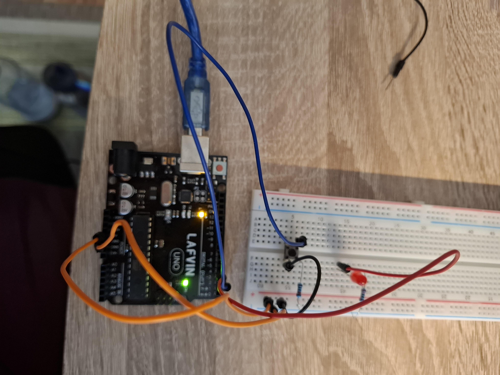
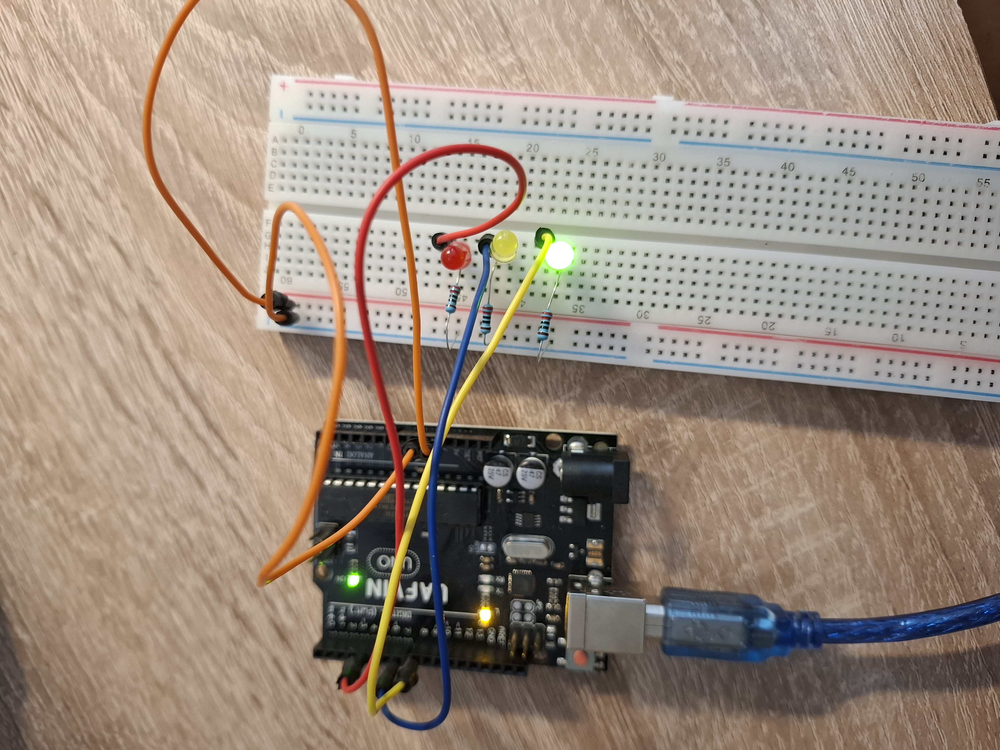

# Button controlled LED
This is a simple task of controlling an LED via a button

## Wiring
Wiring uses a pulldown button and a classic LED connection. (Images will get better in the future)



### Resistances
- Pulldown uses a **10k resistor**, since that is recommended for such usage.
- LED uses **220 resistor**, which is also from recommendation.

One could calculate the resistance. For the led we want very low current (around 10 mA), so we take the LED voltage drop and subtract it from the source. Afterwards we calculate resistance from the remaining voltage and target current using Ohm's law. (The "drops/resistances" are connected in series, so they affect the current accross the whole circuit.)

```
Example for LED:
source_voltage = 5 V
LED_voltage_drop = 2 V (depends on color)
target_current = 10 mA = 0.01 A

remaining_voltage = source_voltage - LED_voltage_drop = 3

target_resistance = remaining_voltage / target_current = 300

We choose from available resistors = 220/330

330 was too strong (no light) so I used 220 Ohm resistor.
```

Resistor are marked with bands, where the first three indicate base value, fourth a multiplier and fifth a tolerance.

# Semaphore LEDs
This is a simple task of controlling multiple LEDs via timing

## Wiring
Wiring uses 3 different circuits (one for each LED)-

