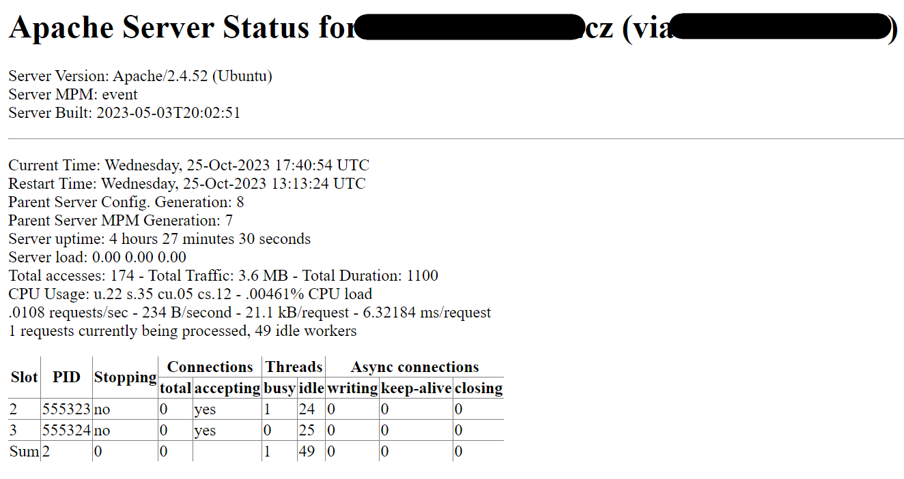

# Úvod
Rozhodl jsem se pro Apache, protože budu potřebovat všechny tutoriály co existují.

# Instalace
Instalace proběhla stejně jako vždy předtím.  
`sudo apt update`  
`sudo apt install apache2`  
`sudo ufw allow 'Apache'`  
U firewall je možnost povolení různých verzí. Prozatím jsem zvolil verzi základní, ale existuje také Apache Secure/Apache Full. 

V konfiguraci poté není nic potřeba měnit. Ihned je dostupná stránka na `adresa.cz`. Ta si bere zdroje z adresáře /var/www/html. Zde jsem zatím ponechal základní html.

# Stránka pro uživatele
Pro samostatné stránky pro jednotlivé uživatele jsem použil modul userdir. Na ten jsem přišel po chvíli experimentování s virtual host, který se však ukázal nevhodným.

Nejdřív jsem ve svém home vytvořil složku public_html, která bude obsahovat vše týkající se webu.  
`mkdir /home/kubix/public_html`  
`sudo chown -R kubix:kubix /home/kubix/public_html`  
`sudo chmod -R 755 /home/kubix/public_html`  

Poté jsem zprovoznil modul userdir.  
`sudo a2enmod userdir`  
`sudo systemctl restart apache2`  
Jelikož však Apache vyžaduje práva čtení pro zobrazení stránky, musel jsem lehce upravit svůj home.  
`sudo chmod 711 /home/kubix`  
Nyní je již možné si zobrazit web pro každého uživatele, který má ve svém home složku public_html.

Například si lze zobrazit stránku `adresa.cz/~kubix`

# Zobrazení statistik
Zobrazení statistik je defaultně již zapnuto a je zpřístupněno pomocí adresy:  
`adresa.cz/server-status`  

Z důvodu bezpečnosti jsem však v konfiguraci apache nastavil tak, aby byly tyto informace dostupné pouze ze sítě tul. Zvolil jsem toto, jelikož adresa mého počítače se stále mění. Tohle celé jsem provedl úpravou konfiguračního souboru apache.  
`sudo nano /etc/apache2/apache2.conf` 
``` 
<Location /server-status>
    SetHandler server-status
    Require ip xxx.xxx.x.x/16
</Location>
```
Po úpravě konfigurace jsem akorát restartoval Apache.  
`sudo systemctl restart apache2`

# Statický obsah
Zde jsem jen vytvořil jednoduché html. Do public_html jsem přidal složku picture, kam jsem vložil obrázek použitý na webu. Do budoucna je poté možné toto html jednoduše rozšířit. Samba se zde ukázala jako užitečný nástroj pro upload obrázku na server.  

# Zakázat listování
Toto bylo jedním z problematičtějších úkolů, jelikož jsem strávil asi 2 hodiny nechápáním fráze "directory listing" a další hodinu soubojem se specifikací složky public_html.

Výsledkem tohoto bádání byla nakonec jednoduchá úprava konfiguračního souboru.  
`sudo nano /etc/apache2/apache2.conf`

```
<Directory /home/kubix/public_html>
        Options -Indexes
</Directory>
```
Toto řešení funguje pouze pro tuto specifickou složku, takže v budoucnu by bylo nutné to samé provést i pro další. Snažil jsem se přijít na způsob jak ovlivnit všechny domovské složky, ale nic nefungovalo. Při testování jsem se pokusil dostat do složky pictures, což se mi nepodařilo. (Forbidden) Proto předpokládám, že vše funguje jak má.  
`adresa.cz/~kubix/pictures/`