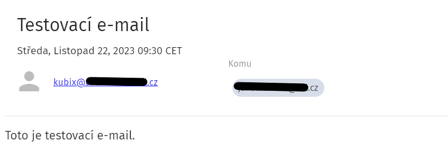
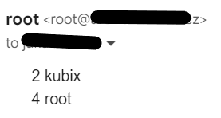

# Instalace
Nainstaloval jsem postfix a mailutils pro práci s maily.  
`apt install postfix mailutils`   
Při konfiguraci jsem zvolil tyto možnosti:   
- internet-site
- adresa.cz

Následně bylo potřeba nainstalovat telnet.  
`apt install telnet`  
Pomocí telnetu jsem otestoval funkčnost mailserveru.  
```
root@adresa:~# telnet localhost 25
Trying xxx.x.x.x...
Connected to localhost.
Escape character is '^]'.
220 adresa.cz ESMTP Postfix (Ubuntu)
```
Vše vypadá dobře.
# Lokální mail
Poté jsem zkusil odeslat mail mezi lokálními uživateli.
```
root@adresa:~# mailx kubix
Cc:
Subject: Zkousim local mail
Toto je testovaci mail pro lokalniho uzivatele.~
.
```
A kubix si je přečetl.
```
kubix@adresa:~$ mail
"/var/mail/kubix": 2 messages 1 new 1 unread
 U   1 root               Wed Nov 22 08:21  17/528   Testovací e-mail
>N   2 root               Wed Nov 22 08:25  15/490   Zkousim local mail
? 2
Return-Path: <root@adresa.cz>
X-Original-To: kubix
Delivered-To: kubix@adresa.cz
Received: by adresa.cz (Postfix, from userid 0)
        id CC8A65A3B; Wed, 22 Nov 2023 08:25:07 +0000 (UTC)
To: kubix@adresa.cz
Subject: Zkousim local mail
User-Agent: mail (GNU Mailutils 3.14)
Date: Wed, 22 Nov 2023 08:25:07 +0000
Message-Id: <20231122082507.CC8A65A3B@adresa.cz>
From: root <root@adresa.cz>

Toto je testovaci mail pro lokalniho uzivatele.~
.
```

# Školní email
Poté jsem poslal mail na svůj školní email.  
`kubix@adresa:~$ echo "Toto je testovací e-mail." | mail -s "Testovací e-mail" moje.jmeno@email.cz`  

# Cron
Nejdřív jsem si připravil příkaz pro vypsání počtu přihlášení:   
`last -s today | awk '{if ($1 != "" && $1 != "wtmp") print $1}' | sort | uniq -c
`

Poté jsem si pro cron vytvořil script.
`nano /usr/local/bin/daily_login_report.sh`
```
#!/bin/bash

# Získání seznamu přihlášení
login_list=$(last -s today | awk '{if ($1 != "" && $1 != "wtmp") print $1}' | sort | uniq -c)

# Odeslání výsledků e-mailem
echo "$login_list" | mail -s "Denní přehled přihlášení" jakub.silhan@tul.cz
```
Pro skript jsem upravil oprávnění, aby jej mohl spouště pouze root.(Nechci spam od běžných uživatelů)  
`chmod 700 /usr/local/bin/daily_login_report.sh`  
Byla nutná instalace cron.
`apt install cron`
Nakonec jsem v nastavení cronu přidal řádek pro spuštění skriptu každý den o půlnoci.
`crontab -e`
```
0 0 * * * /usr/local/bin/daily_login_report.sh
```
Zkontroloval jsem pomocí `crontab -l` a vše vypadalo v pořádku.

