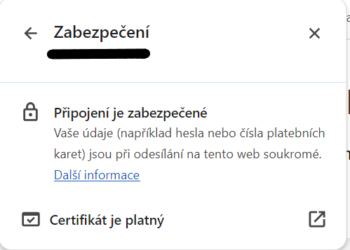

# Instalace
Pro zprovoznění zabezpečení bylo nejdříve potřeba nainstalovat dva nástroje.  
`sudo apt install certbot python3-certbot-apache`  
Certbot je nástroj pro manuální tvoření Let's Encrypt certifikátů a ta druhá instalace se stará o propojení s apachem.

# Virtual Host
Jelikož jsem měl stránku nejdříve nastavenou pouze defaultně, tak jsem si vytvořil vlastní config.  
`sudo nano /etc/apache2/sites-available/your_domain.conf`  
Zde jsem akorát zadal o jakou doménu se jedná a kde má root directory.
```
<VirtualHost *:80>
    ServerAdmin moje.jmeno@email.cz
    ServerName adresa.cz
    DocumentRoot /var/www/html/adresa
    ErrorLog ${APACHE_LOG_DIR}/error.log
    CustomLog ${APACHE_LOG_DIR}/access.log combined
</VirtualHost>
```
Poté jsem jen aktivoval tento config a deaktivoval ten defaultní.  
`a2ensite adresa.conf`  
`a2dissite 000-default.conf`  

# Nastavení firewall
Zde jsem musel změnit nastavení firewall na apache secure, aby byl možný přístup pouze přes https.  
`ufw allow 'Apache Secure'`  
`ufw delete allow 'Apache'`  

# Certbot
Nakonec jsem jen vytvořil certifikát.  
`certbot --apache`  
Zde se mě to zeptalo na pár věcí a při volbě domén jsem zvolil adresa.cz. (Jediná volba).  

Pro kontrolu jsem se ještě podíval na web skrz prohlížeč a už zde byla ikona zabezpečení s platným certifikátem.


# Firewall
Moje firewall nastavení vypadá takto:  
```
To                         Action      From
--                         ------      ----
22/tcp                     ALLOW       Anywhere
OpenSSH                    ALLOW       Anywhere
21                         ALLOW       xxx.x.x.x/16
20                         ALLOW       xxx.x.x.x/16
Samba                      ALLOW       xxx.x.x.x/16
2049                       ALLOW       xxx.x.x.x/16
Apache Secure              ALLOW       Anywhere
22/tcp (v6)                ALLOW       Anywhere (v6)
OpenSSH (v6)               ALLOW       Anywhere (v6)
Apache Secure (v6)         ALLOW       Anywhere (v6)
```
Myslím si, že nastavení firewall je vhodné. Zvolil jsem možnost Apache Secure pro povolení pouze https, které je v dnešní době preferované.  

# Lokace adresářů
Všechny moje služby až na `www` se vyskytují v `/srv`. To se mi zdá vhodné jelikož se jedná o složku pro služby. `www` mám uloženo ve `/var` což je lehce zvláštní (šel jsem podle tutoriálů), ale co se mi podařilo dohledat, tak některý software toto umístění může vyžadovat. Proto bych asi nic neměnil.
